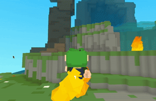

<picture>
  <source media="(prefers-color-scheme: dark)" srcset="misc/Github_Banner_Transparent_Dark.jpg">
  <source media="(prefers-color-scheme: light)" srcset="misc/Github_Banner_Transparent_Light.jpg">
<p align="center">
  
</p>
</picture>

<!--  -->
[](https://cu.bzh/discord)

## What is Blip?

Blip is a **User Generated Social Universe**, an online platform where all items, avatars, games, and experiences are made by users from the community.

It's a limitless building environment inspired by Roblox, but designed to be as welcoming and accessible as Minecraft.

### Blip is for all kinds of creators:

- Hobbyists, Experts, Beginners...
- Developers, Artists, Avatar designers, Home builders, Decorators, etc.
- For those going solo as well as for those seeking collaboration.

### Fully scriptable

Developers can script right from within Blip, on all platforms (yes, including mobile):

<p align="center">

</p>

- All experiences in Blip are scripted in [Lua](https://www.lua.org).
- Developers can script both client and server sides. (Blip provides a free scalable server infrastructure for real-time multiplayer)
- Blip system APIs are documented here: [docs.cu.bzh/reference](https://docs.cu.bzh/reference)
- Higher-level APIs are available in the form of open-source [modules](https://docs.cu.bzh/modules), hosted on GitHub. Here's how you can import them:

	```lua
	Modules = {
		fire = "github.com/aduermael/modzh/fire"
	}

	Client.OnStart = function()
		Player:SetParent(World)
		Camera:SetModeThirdPerson()
	
		f = fire:create()
		f:SetParent(Player)
		-- now Player is on fire
	end
	```
	<p align="center">
		
	</p>
	
- [Blip API documentation](https://docs.cu.bzh) is generated from the [lua](https://github.com/bliporg/blip/tree/main/lua) folder in that repository.
	

### Lightweight, All-In-One & Cross-Platform

All features are bundled into one comprehensive cross-platform application; there's no separate "studio" app for creators.

Blip runs on its own in-house C/C++ engine, using the [BGFX](https://github.com/bkaradzic/bgfx) library for cross-platform rendering.

## Supported platforms

- iOS / iPadOS
- Android
- Windows
- macOS
- Web Browsers (Chrome, Firefox, Safari, Edge)

## Development

Most communication among contributors, players, and creators takes place on the [official Discord server](https://cu.bzh/discord).

## Open Source

- The main components of Blip are open source (C engine, CLI, Lua modules, `.3zh` [voxel file format](https://github.com/bliporg/blip/blob/main/cubzh-file-format-3zh.txt)).
- It's not yet possible to build the app itself; we're actively working on open-sourcing missing parts to allow it.
- The goal is for Blip to become an engine anyone could fork to deploy their own custom User Generated Content platform.

Please help Blip with a ⭐️!

<p align="center">
	
</p>
