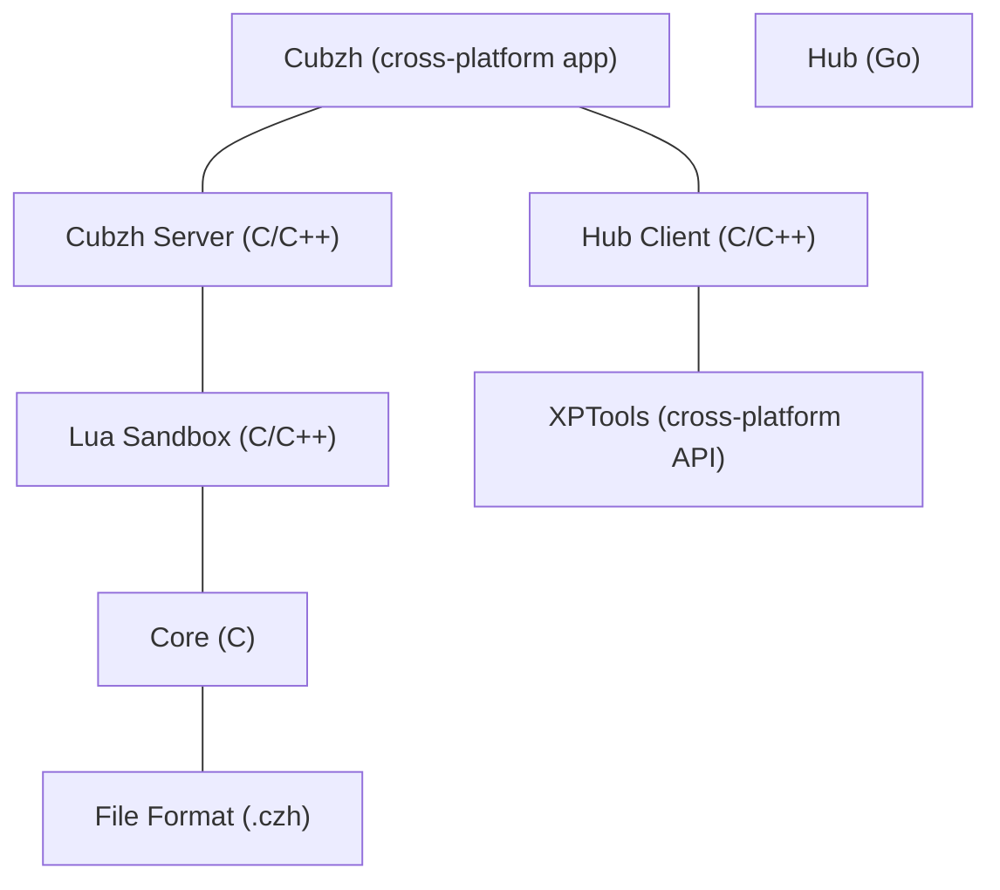

<picture>
  <source media="(prefers-color-scheme: dark)" srcset="https://raw.githubusercontent.com/cubzh/cubzh/readme/misc/logo_and_name_light.svg">
  <source media="(prefers-color-scheme: light)" srcset="https://raw.githubusercontent.com/cubzh/cubzh/readme/misc/logo_and_name_dark.svg">
  
</picture>

Cubzh is an open-source voxel game platform connected to a fully decentralized ecosystem. (*voxel* == *volumetric pixel* == *cube*, in that context)

Cubzh runs on mobile (iOS, Android), desktop (Windows, macOS) & web browsers (Chrome, Firefox). It can be built as an all-in-one application embedding its game execution sandbox, a code editor & an item editor.

We're open-sourcing it, one module after the other. The goal is to host every single bit of the project on this repository, by the end of 2023. Elements open-sourced (✅) + ones about to be:

```mermaid
graph TD
    Cubzh["Cubzh (cross-platform app)"]
    Core["Core (C)"]
    CubzhServer["Cubzh Server (C/C++)"]
    LuaSandbox["Lua Sandbox (C/C++)"]
    FileFormat["File Format (.czh)"]
    HubClient["Hub Client (C/C++)"]
    XPTools["XPTools (cross-platform API)"]
    Hub["Hub (Go)"]
        
    Core---FileFormat
    CubzhServer---LuaSandbox
    LuaSandbox---Core
    Cubzh---CubzhServer
    Cubzh---HubClient
    HubClient---XPTools
```

Cubzh's decentralized ecosystem lives on its own application-specific blockchain, within [Cosmos](https://tutorials.cosmos.network) network.
