<picture>
  <source media="(prefers-color-scheme: dark)" srcset="https://raw.githubusercontent.com/cubzh/cubzh/main/misc/logo_and_name_light.svg">
  <source media="(prefers-color-scheme: light)" srcset="https://raw.githubusercontent.com/cubzh/cubzh/main/misc/logo_and_name_dark.svg">
  
</picture>

Cubzh is a voxel game platform. (*voxel* == *volumetric pixel* == *cube*, in that context)

It all started as a [Lua](https://www.lua.org/) scripting environment focused on voxel manipulation & real-time communication.

Our goal is to build the most exciting and accessible place for artists, developers & players.

It's free, it runs on many different platforms, we're open sourcing it, decentralizing it (eventually), it's in Alpha... we need your help to build it! 🙂

### Supported platforms

Cubzh runs on mobile (iOS, Android), desktop (Windows, macOS) & web browsers (Chrome, Firefox).

It's an all-in-one application embedding its game execution sandbox, an item editor, a world editor, a code editor and a marketplace.

### Open Source

We're open-sourcing Cubzh, one module after an other. Elements open-sourced (✅) + ones about to be:

```mermaid
graph TD
    Cubzh["Cubzh (cross-platform app)"]
    Core["✅ Cubzh Core (C)"]
    CubzhServer["Cubzh Server (C/C++)"]
    LuaSandbox["Lua Sandbox (C/C++)"]
    FileFormat["✅ File Format (.3zh)"]
    HubClient["Hub Client (C/C++)"]
    XPTools["XPTools (cross-platform API)"]
    Hub["Hub (Go)"]
    CubzhServerScheduler["Cubzh Server Scheduler (Go)"]
        
    Core---FileFormat
    CubzhServer---LuaSandbox
    LuaSandbox---Core
    Cubzh---CubzhServer
    Cubzh---HubClient
    HubClient---XPTools
```

Coming next: cross-platform API.

### Open Distribution

Even though we're officially maintaining native Cubzh clients (iOS, Android, Windows, macOS), we would like creators to be able to distribute their worlds via custom web domains. We're almost there, please contact us if you're interested in that feature.

### Decentralization

We're deeply convinced decentralized marketplaces are such a natural fit for user generated content environments like Cubzh. A reputation based decentralized governance would also be a good thing.

We've been studying blockchain technologies for a while. But as of today, there's still no execution plan.

We don't want to sacrifice user experience. In any way, we don't want decentralization to make it less accessible or less free-to-play.

We'll keep thinking about it and see where it leads us, sharing concerns and critical decisions here and on Discord.

### Features & to-do list

#### Done

- ✅ Supported platforms: iOS, Android, Windows, macOS
- ✅ Item Editor
- ✅ File Import / Export (.3zh, .vox)
- ✅ Lua Scripting Environment
	- ✅ Physics / Collisions
	- ✅ Data Store
	- ✅ Real-time communication (events)
	- ✅ Multiple cameras
	- ✅ HTTP client
- ✅ Anonymous Accounts

#### In progress

- ⚙️ Web Browser support (Chrome & Firefox)
- ⚙️ World Editor
- ⚙️ Avatar Editor
- ⚙️ Items made out of multiple shapes
- ⚙️ Animation Editor
- ⚙️ Custom Color Palettes
- ⚙️ Sounds
- ⚙️ Lights / Shadows

#### To-do

- Currency
- Marketplace
- Friends
- Block Textures
