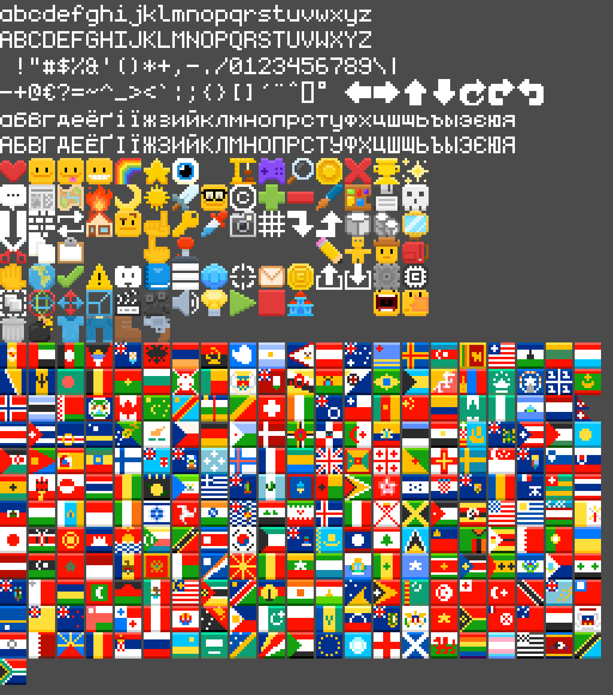

# Cubzh's Font

This is the font we use in Cubzh.

We're using very small bitmap characters and scaling them up depending on screen size and pixel density, preserving pixel perfect display.

The font is used in the embedded code editor, to write Lua scripts, that's why we want it to be monospace (all characters have the same width).

We love emojis, we wanted them to be super sharp (no anti-aliasing) while not breaking monospace alignment. That's why each character is `5 x 11` pixels, and each emoji is `11 x 11` pixels (2 chars + 1 space).

## How to contribute?

You can help us including more characters and emojis. There are simple guidelines:

- A character should be `5 x 11` pixels
- Characters should be white
- An emoji should de `11 x 11` pixels, ideally there should be at least `1` pixel in contact with all 4 edges
- Reuse colors from other emojis as much as possible
- Use brighter pixels to emphasize top edges, simulating light coming from the top
- Use darker pixels to emphasize bottom edges
- Add new character coordinates in `font.txt`

## Is it ok to use the font elsewhere?

Yes! The font, and everything you can find on this repository is under MIT License. It's very permissive, the only thing required is to include the [copyright notice](https://github.com/cubzh/cubzh/blob/master/LICENSE) in your product.

